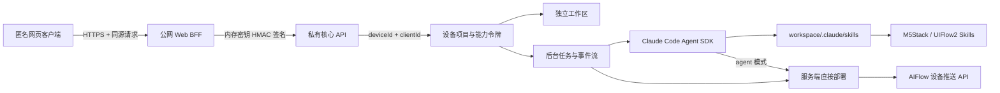

# AIFlow Web Agent Service

面向免登录网页客户端的 UIFlow2 Coding 与设备部署服务。初始化时客户端必须同时提供 `deviceId` 和 `clientId`，MAC 可选；`deviceId` 是前后端统一项目主键，`clientId` 用于资源上传标识。每台设备由服务端签发能力令牌，并拥有独立 Claude Code 历史、项目工作区和任务状态。

## 架构



核心行为：

- 无账号登录。`POST /api/v3/contexts` 必须接收客户端传入的 `deviceId + clientId`，并可选接收 MAC；仍以 `deviceId` 幂等连接，新设备创建项目，已有设备复用历史、更新提供的绑定字段并轮换能力令牌。
- 公网只启动匿名 Web BFF。浏览器不持有签名密钥；BFF 用进程内随机密钥为每个内部请求签入时间戳、nonce 和请求体哈希，核心 API 不单独监听公网端口。
- 网关按匿名 HttpOnly 会话和来源 IP 限流；核心另有 AI 分钟/每日、全局每日费用上限和有界并发队列。
- 高频普通请求限流使用单进程内存窗口，AI 任务额度持久化到 SQLite 并在线程池执行，避免慢磁盘阻塞网页和 SSE。
- 任务事件使用 SQLite WAL/NORMAL 并在线程池逐条持久化，保留完整公开流的同时避免虚拟磁盘 fsync 拖慢模型读取。
- 每个设备项目独立存储于 `projects_data_v3/clients/<context_id>/workspace`，SQLite 只保存令牌哈希；所有项目、任务、会话响应都带 `device_id` 供前端对齐。
- Claude Code 的模型、预算、工具、sandbox、MCP 和 Skill 在 [server_config.json](server_config.json) 配置。
- `skills/` 下启用的 Skill 会复制到当前上下文的 `.claude/skills/`，仅加载项目设置，不加载用户级 Claude 设置。
- Agent 只接受 M5Stack UIFlow2/MicroPython 编程、调试、审查和解释任务；一般问答、非 M5Stack 编程以及纯产品咨询会被拒绝或要求补充目标板卡与编程目标。
- Agent 的澄清、工具前后进度和最终回复均跟随用户本人使用的语种；UIFlow/API 名称、Skill、MCP、文档、代码、日志和工具结果不会改变回复语言，技术标识保持自然原文。
- Coding 是后台任务。SSE 断开不会停止 Agent，客户端可随时轮询状态或按序恢复事件。
- `direct-run` 跳过 Agent，直接重新推送保存的 `main.py` 和资源清单。
- Coding 请求可携带 Base64 图片和语音；客户端必须提供附件文件名，服务端按该名称解码到项目 `inputs/`，只把相对路径交给 Agent，不在 SQLite 保存 Base64 原文。
- 可选的火山 TLS 对话审计将每个 `task_id` 作为唯一轮次，以 `conversation_id + turn_index + event_sequence` 保存用户输入、SDK 最终完整文本与 SDK 暴露的 thinking、工具调用/结果和终态；公开 SSE/history 同时发送脱敏后的 thinking 增量与最终块，上传前先写 SQLite outbox，失败或重启后续传。

目录职责：

```text
aiflow_server/   当前服务实现
docs/            V3 API、网页接入、底层推送和设计计划
examples/        V3 调用示例
legacy/v2/       只用于迁移比对的旧服务和客户端
skills/          每个设备项目默认加载的 Skills
tests/           隔离、容量、并发、附件和推送测试
```

## 运行

```bash
./manage.sh install
./manage.sh start
./manage.sh status
```

`install` 检测到从其他系统复制而来或链接失效的 `.venv` 时，会先将它移动到 `.runtime/venv-backups/`，再用当前机器的 Python 重建；不会覆盖旧环境。Debian/Ubuntu 如果缺少 `venv` 模块，先安装 `python3-venv`。

默认地址：

- 监听地址：`0.0.0.0:8880`
- 本机网页客户端：`http://127.0.0.1:8880/client`
- 局域网网页客户端：`http://<服务端局域网 IP>:8880/client`
- OpenAPI UI：`http://<服务端局域网 IP>:8880/docs`

`./manage.sh start` 和 `./manage.sh status` 会尽量检测并打印当前 LAN URL。内置客户端全部使用同源 API，请直接用服务端局域网 IP 打开页面，不需要为它添加 CORS Origin。独立部署在其他 Origin 的前端仍需将精确 Origin 加入 `server.cors_origins`。

生命周期命令：

```bash
./manage.sh run       # 前台运行
./manage.sh stop
./manage.sh restart
./manage.sh logs
./manage.sh config
./manage.sh client
./manage.sh test
./manage.sh open
```

`start` 会等待 `/health` 真正返回成功，默认最多等待 60 秒；磁盘较慢的服务器可通过
`AIFLOW_START_TIMEOUT_SECONDS` 调整。`status` 同时检查进程、`/health` 和 `/ready`，不会只检查 PID。

## 匿名网页安全

`./manage.sh run/start` 只启动 `aiflow_server.gateway:app`。它在同一进程内创建不可由公网寻址的核心 API，并使用不下发、不落盘的随机 HMAC 密钥进行内部调用。不要手工把 `aiflow_server.app:app` 监听到公网。

生产必须由 Nginx/Caddy/负载均衡器终止 HTTPS，并设置：

```dotenv
AIFLOW_WEB_COOKIE_SECURE="true"
```

匿名网页不登录，所以无法从密码学上区分“真人浏览器”与“完整模仿网页协议的脚本”。隐藏 JavaScript 算法或把固定密钥写进网页都无效。当前可执行的费用保护是：

- 只暴露 BFF，模型密钥、核心签名密钥和核心应用均不暴露给浏览器。
- 修改请求必须来自同源或 `server.cors_origins` 明确允许的 Origin，减少 CSRF 和站外盗用。
- 网关同时按签名匿名会话与来源 IP 限制普通请求和 AI 任务；清 cookie 不能绕过 IP 日限额。
- 核心继续执行全局 AI 日限额、单进程有界队列和同设备单任务约束。
- 对公网高流量场景，在 Nginx/CDN 再加 IP/ASN 限速、异常封禁和 Turnstile/验证码。无登录产品想进一步限制机器人，这一层不可省略。

限额在 [server_config.json](server_config.json) 的 `web_gateway` 和 `cost_guard` 中机械配置。`./manage.sh config` 会打印当前值且不显示模型密钥。完整边界见 [CLIENT_SECURITY.md](docs/CLIENT_SECURITY.md)。

## 第三方模型与 Claude Code

第三方服务必须兼容 Claude Code 使用的 Anthropic Messages API。只有 OpenAI `/v1/chat/completions` 兼容、但不支持 Anthropic 请求格式的 URL 不能直接使用。

复制 [.env.example](.env.example) 为 `.env.local`，填写第三方配置：

```bash
cp .env.example .env.local
```

```dotenv
ANTHROPIC_BASE_URL="https://your-provider.example.com"
ANTHROPIC_AUTH_TOKEN="your-bearer-token"
AIFLOW_CLAUDE_MODEL="your-provider-model-id"
AIFLOW_CLAUDE_CONTEXT_WINDOW_TOKENS="258000"
AIFLOW_CLAUDE_MAX_TURNS="30"
AIFLOW_CLAUDE_SUPPORTS_IMAGE_INPUT="false"
```

- `ANTHROPIC_BASE_URL`：第三方提供的 Anthropic 兼容基础 URL，按提供方要求决定是否包含 `/v1`，不要自行追加 `/messages`。
- `ANTHROPIC_AUTH_TOKEN`：使用 `Authorization: Bearer` 的网关令牌。
- `ANTHROPIC_API_KEY`：使用 `x-api-key` 的提供方改用此变量；与 `ANTHROPIC_AUTH_TOKEN` 二选一。
- `AIFLOW_CLAUDE_MODEL`：第三方实际暴露的完整 model ID，服务会作为 Claude Code 的 `--model` 传入。
- `AIFLOW_CLAUDE_CONTEXT_WINDOW_TOKENS`：传给 Claude Code 的 `CLAUDE_CODE_MAX_CONTEXT_TOKENS`，控制自动压缩所使用的有效上下文上限；默认 `258000`（258K）。实际可用上限仍受提供方模型限制。
- `AIFLOW_CLAUDE_MAX_TURNS`：Agent 单次任务最大对话轮次，默认 `30`。
- `AIFLOW_CLAUDE_SUPPORTS_IMAGE_INPUT`：模型是否支持图片输入。DeepSeek 等纯文本模型设为 `false`；默认 `true`。

`.env.local` 默认不进入 Git。也可以通过 `AIFLOW_ENV_FILE=/secure/path/provider.env` 指向部署环境生成的配置文件。修改后检查并重启：

```bash
./manage.sh config
./manage.sh restart
./manage.sh status
```

`config` 只显示有效 model ID、URL 和认证变量名，不输出密钥。

### 火山 TLS 对话日志

`server_config.json -> telemetry` 保存非敏感默认参数和专用 Topic；访问密钥、Secret 与匿名化 HMAC 密钥只放在 `.env.local`：

```dotenv
TLS_LOG_ENABLED="1"
TLS_ACCESS_KEY="your-volcengine-access-key"
TLS_SECRET_KEY="your-volcengine-secret-key"
TLS_PSEUDONYM_KEY="your-independent-random-secret"
```

服务实时发送模型文本和 thinking delta，最终块到达后由客户端按 `response_id + block_index` 覆盖校准；TLS 只把 SDK 最终完整内容块写入 outbox，流中断时只保存一次 partial 兜底，不重复上传每个 delta。后台线程批量上传，不在每一轮复制完整历史，也不阻塞 asyncio 模型流。当前按固定的 `claude-agent-sdk==0.2.128` 审计全部消息/内容块；thinking 仅指模型提供方实际交给 SDK 的内容。逻辑重复会在上传前消除，网络超时造成的至少一次重传由消费端按 `record_id` 去重。`GET /api/v3/system/status` 的 `conversation_logging` 可检查上传线程和积压数量。字段、覆盖矩阵、聚合重建、隐私边界与故障恢复详见 [CONVERSATION_LOGGING.md](docs/CONVERSATION_LOGGING.md)。

模型 ID 也可写入 [server_config.json](server_config.json) 的 `claude.model`，或临时使用 `AIFLOW_CLAUDE_MODEL` 覆盖；API Key 不要写入 JSON、网页请求或设备资料。

### Claude Code 运行参数

编辑 [server_config.json](server_config.json) 的 `claude` 部分：

```json
{
  "claude": {
    "model": "claude-sonnet-4-5",
    "fallback_model": null,
    "supports_image_input": true,
    "context_window_tokens": 258000,
    "max_turns": 30,
    "max_budget_usd": null,
    "effort": "high",
    "permission_mode": "dontAsk",
    "sandbox_enabled": true,
    "allowed_tools": ["Read", "Write", "Edit", "Glob", "Grep", "Bash"],
    "skills": ["uiflow2-coder", "m5stack-assistant", "aiflow-device-push"]
  }
}
```

环境变量优先于文件：

```text
AIFLOW_SERVER_CONFIG
AIFLOW_HOST
AIFLOW_PORT
AIFLOW_DATA_DIR
AIFLOW_SKILLS_DIR
AIFLOW_CLAUDE_MODEL
AIFLOW_CLAUDE_FALLBACK_MODEL
AIFLOW_CLAUDE_CONTEXT_WINDOW_TOKENS
AIFLOW_CLAUDE_MAX_TURNS
AIFLOW_CLAUDE_SUPPORTS_IMAGE_INPUT
AIFLOW_MAX_SESSIONS
AIFLOW_MAX_CONCURRENT_TASKS
AIFLOW_MAX_QUEUED_TASKS
```

Claude Code SDK 会继承服务进程环境。当前服务显式用 `AIFLOW_CLAUDE_MODEL`/`claude.model` 固定模型，并保留 `ANTHROPIC_BASE_URL` 和认证变量给 Claude Code CLI 使用。

`context_window_tokens` 通过 Claude Code CLI 的 `CLAUDE_CODE_MAX_CONTEXT_TOKENS` 环境变量生效；这是自动压缩阈值/有效上下文上限，不是 Anthropic SDK 的任意 `context_window` 参数。对于支持更大上下文的第三方模型，可以把它提高到提供方允许的值；本项目默认使用 258K。`max_turns` 同时传给 Claude Agent SDK 的 `ClaudeAgentOptions.max_turns`。

`supports_image_input=false` 时，服务不会把图片内容发送给模型，并通过 `PreToolUse` 硬性拒绝 Agent 对图片文件调用 `Read`。Agent 仍会收到文件名、相对路径、MIME 和大小，可直接在 UIFlow2 代码中引用图片路径，并将图片加入 `.aiflow/deploy.json`；它不得解码、OCR、描述或猜测图片内容。文字代码、UIFlow2 文档以及其他非图片文件仍可正常读取。

### Agent 固定工作流

每个有效 Coding 任务按以下原则执行：

1. 编写或修改 UIFlow2 代码时优先建议使用 `uiflow2-coder` 查 Skill 自带的官方文档，但这不是工具调用顺序的硬限制；已有信息足够或任务不需要 UIFlow2 文档时可以跳过。
2. 需要确认产品规格、屏幕、按键、引脚、电气特性、兼容性、固件/API 行为或排障依据时，可以直接使用 `m5stack-assistant` 查询官方 MCP，也允许它先于 `uiflow2-coder` 调用，避免无意义的前置查询。
3. 官方资料缺失、冲突、明显错误、官方示例损坏或 MCP 工具异常，经复查后按 `m5stack-assistant` 要求调用 `knowledge_feedback`；只有返回 `feedback_id` 才算已提交。普通用户代码 bug 不会上报。
4. Agent 写入 `main.py` 并做最小本地验证。存在未确认的关键硬件/API 信息时停止，不猜测、不推送。
5. 只有 `deploy_mode=agent` 会向 Agent 暴露 `aiflow-device-push`、设备目标和推送网络；此时先执行一次 `plan`，再执行一次最终推送。`server` 由服务端在 Agent 结束后推送，`none` 完全不推送。

服务会在运行时自动把 `Skill` 加入基础工具集合，并精确放行 `m5stack-assistant` 使用的 `knowledge_search`、`knowledge_answer`、`knowledge_feedback`，无需在 `claude.allowed_tools` 中重复配置这些动态工具。

## 内置网页客户端

服务启动后运行：

```bash
./manage.sh client
```

也可直接打开 `http://127.0.0.1:8880/client`。页面接收客户端提供的 `deviceId` 和 `clientId`，连接后可提交 Coding、附加图片/语音、查看任务事件和项目文件、取消任务或直接运行保存的 `main.py`。

能力令牌只保存在当前标签页的 `sessionStorage`。选择“只生成代码”不会操作设备；选择“服务端推送”“Agent 推送”或点击“直接运行 main.py”会提交设备变更任务。

## 设备目标

客户端初始化必须同时提交平台 `deviceId` 和上传标识 `clientId`，MAC 可选。网页配对后直接发送：

```json
{
  "device_id": "由客户端配对流程取得的平台设备 ID",
  "client_id": "由客户端生成或取得的上传 Client ID",
  "mac_address": "可选，设备 MAC 地址",
  "product": "CoreS3",
  "firmware_version": "2.x"
}
```

同一 `device_id` 再次调用 `POST /api/v3/contexts` 会返回原 `context_id`、项目和会话历史，更新本次提供的 `client_id`/MAC；省略 MAC 不会清除历史 MAC，且 `created=false`。输入同时兼容 `mac`、`macAddress`、`mac_address`。新令牌会使旧令牌失效，前端应立即替换 `sessionStorage` 中的值。

服务端或 Agent 发起代码推送时使用 `deviceId` 路径参数；上传资源文件时同时发送 `deviceId` 和 `clientId`。两个值都只从初始化上下文机械读取，不放入 Agent 提示词，也不会用内部 `context_id` 兜底。

## 容量与并发队列

[server_config.json](server_config.json) 中：

```json
{
  "capacity": {
    "max_sessions": 100,
    "session_active_window_seconds": 60,
    "max_concurrent_tasks": 4,
    "max_queued_tasks": 20
  }
}
```

- `max_sessions`：最多保留多少个设备项目；同一 `deviceId` 重连不重复占位。
- `session_active_window_seconds`：`recently_active` 的最近活动统计窗口，不影响容量占用。
- `max_concurrent_tasks`：同时真正执行的 Claude Coding 或直接部署任务数。
- `max_queued_tasks`：并发槽满后仍可等待的任务数。
- `GET /api/v3/system/status`：实时返回会话容量、运行数和排队数，不包含设备标识。
- `POST /api/v3/asr`：服务端代理火山引擎 SAUC 非流式语音识别，上传 WAV 后返回整句文本；`POST /api/v3/asr/stream` 接受 ESP32 可边录边传的原始 PCM 流。配置和错误码见 [API_V3.md](docs/API_V3.md)。
- 新设备容量满返回 `503 session_capacity_full`；任务总容量满返回 `429 task_queue_full`。

当前限制器支持单个服务进程内的多设备并发，并保持同一设备同时最多一个任务。不要启动多个 Uvicorn worker；多进程或多实例会各自拥有独立信号量，需要先将调度迁移到 Redis/外部队列。

## 图片和语音消息

`POST /api/v3/tasks/coding` 的 `attachments` 使用原始 Base64 字符串：

```json
{
  "prompt": "根据图片和语音修改程序",
  "deploy_mode": "none",
  "attachments": [
    {"kind":"image","mime_type":"image/png","name":"screen.png","data_base64":"..."},
    {"kind":"audio","mime_type":"audio/wav","name":"question.wav","data_base64":"..."}
  ]
}
```

支持纯文字、纯附件或混合消息。`name` 是必填的客户端文件名，服务端校验其为不含目录的单个文件名、扩展名与 MIME 一致，并按该名称保存；同一消息内不允许文件名重复。附件数量、单文件大小和单条消息总大小在 `messages` 配置。

## Coding 与部署模式

`POST /api/v3/tasks/coding` 的 `deploy_mode`：

| 值 | 行为 |
| --- | --- |
| `none` | 只生成代码，不操作设备 |
| `server` | Agent 完成后，由服务端直接推送，推荐用于网页“一键生成并运行” |
| `agent` | 明确授权 Agent 在代码验证后调用 `aiflow-device-push`，先 `plan` 再做一次最终推送 |

服务端直接重跑：

```http
POST /api/v3/tasks/direct-run
X-AIFlow-Context-Token: <context token>
Content-Type: application/json

{"code_path":"main.py","include_resources":true}
```

该请求立即返回 `202 + task_id`，不会让网页等待设备网络超时。

## 资源清单

Agent 或客户端可在工作区创建 `.aiflow/deploy.json`：

```json
{
  "resources": [
    {"file": "assets/logo.png", "devicePath": "res/img/"},
    {"file": "assets/startup.wav"}
  ]
}
```

`devicePath` 是设备 Flash 根目录下的相对目录，不是文件名。UIFlow 代码中的 `/flash/res/img/logo.png` 对应清单目录 `res/img/`；`file://flash/res/audio/startup.wav` 对应 `res/audio/`。图片和支持的音频通常可省略 `devicePath`，由上传接口按扩展名自动放到上述目录。

`include_resources=true` 时先推资源，再推 `main.py`。所有路径必须留在当前工作区内。
资源数组只应包含图片、音频等非代码文件。若清单误把本次部署的代码文件列为资源，服务端会自动排除它，代码仍只通过代码推送接口发送。

## 状态与卡死判断

客户端同时使用：

- `GET /api/v3/tasks/{task_id}`：权威状态快照。
- `GET /api/v3/tasks/{task_id}/events`：实时 SSE。
- `GET /api/v3/tasks/{task_id}/events/history?after=N`：断线补事件。

状态响应包含服务心跳年龄、Agent 静默秒数和 `possibly_stalled`。SSE 只是体验层，状态接口才是恢复与判定依据。

## 安全边界

- 能力令牌等同于该网页上下文的访问权限；只返回一次，浏览器建议放 `sessionStorage`。
- 生产环境必须启用 HTTPS、Secure Cookie，并且只运行 `aiflow_server.gateway:app`；内部核心签名由网关自动完成。
- 匿名会话/IP 限额降低机械调用风险，但不是用户身份认证；公网产品仍应在 CDN/WAF 配置限速和风险触发式人机验证。
- API 不提供全局项目列表，令牌只能访问所属任务、会话和文件。
- 创建上下文时服务端信任浏览器提交的 `deviceId` 和 `clientId`；如需证明设备归属，必须接入配对系统的签名断言。
- 当前版本不自动过期上下文；客户端删除项目时应调用上下文删除接口，生产环境需配置保留期和运维清理策略。
- 网页 Origin 必须精确加入 `server.cors_origins`，生产环境不要对能力令牌接口使用通配 CORS，并应使用 HTTPS。
- Claude Code 使用独立 cwd、项目级 Skill、项目级设置和 Bash sandbox。生产环境仍建议每个服务实例运行在专用 OS 用户或容器中。
- 当前任务执行器是有界的单进程内存协调器，使用一个 Uvicorn worker。横向扩展前需要把任务队列和取消控制迁移到 Redis/队列系统。
- HTTP 推送成功只代表服务端发布成功，不代表设备已执行或保存；设备 ACK/状态需要下游另行确认。

## 文档

- [API_V3.md](docs/API_V3.md)：完整接口协议、容量状态和多模态消息格式。
- [CLIENT_SECURITY.md](docs/CLIENT_SECURITY.md)：匿名 Web BFF、内部签名、防重放、费用限额和 Agent 事件脱敏。
- [CONVERSATION_LOGGING.md](docs/CONVERSATION_LOGGING.md)：TLS 对话事件 schema、可靠上传、隐私边界和多轮重建。
- [analytics/README.md](analytics/README.md)：独立 TLS 拉取、复杂统计、趋势对比和单轮时间线后端。
- [WEB_CLIENT_INTEGRATION.md](docs/WEB_CLIENT_INTEGRATION.md)：网页端对接流程与 JavaScript 示例。
- [THIRD_PARTY_DEVICE_PUSH_API.md](docs/THIRD_PARTY_DEVICE_PUSH_API.md)：底层设备推送接口语义。
- [V2_MIGRATION.md](docs/legacy/V2_MIGRATION.md)：V2 到 V3 迁移说明。
