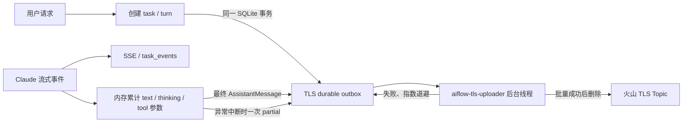

# AIFlow Claude Code 对话日志上传说明

## 1. 结论与边界

AIFlow 把每个 Coding 或 direct-run 任务定义为一轮对话（turn），把同一轮的用户请求、实际 Claude query、SDK 系统消息、模型回复、SDK 暴露的 thinking、工具调用与结果、用量、费用、文件、部署、错误和终态写入 SQLite durable outbox，再由后台线程批量上传到火山引擎 TLS。

当前实现按 `claude-agent-sdk==0.2.128` 审计。该版本的全部顶层消息类型和全部 Assistant 内容块都有处理路径，测试会在 SDK 联合类型变化时失败，避免升级后静默漏记。

这里的“完整 thinking”有严格边界：模型或提供方只有把思考作为 `ThinkingBlock` 或 `thinking_delta` 交给 Claude Agent SDK，AIFlow 才能记录。提供方从未返回的内部状态无法由应用获取，不能把“日志中没有 thinking”直接判定为上传丢失。正常结束时记录最终完整 `ThinkingBlock`；流在最终块前中断时记录已接收的 partial。脱敏后的 thinking delta、最终块和 partial 同时进入公开 SSE/`task_events`，原始签名和敏感标识仍不公开。

日志不是未经处理的进程转储。凭证、能力令牌、Cookie、原始 `deviceId`/`clientId`、绝对工作区路径和敏感工具参数会脱敏；thinking signature 只保存 SHA-256；附件正文不上传，只保存文件名、MIME、大小、相对路径和 SHA-256。输入/输出 token 数、费用和时长不是凭证，会完整保留。

## 2. 数据流与异步行为



模型流不会等待 TLS 网络请求。Agent 协程只通过 `asyncio.to_thread` 等待本地 SQLite 事务提交，保证事件先落盘；真正的 TLS 请求在独立线程中批量执行。网络错误、进程退出或服务重启不会丢掉已经写入 outbox 的记录，下一次启动会继续发送。

公开实时流和 TLS 审计日志用途不同：`assistant_text_delta` 与 `agent_reasoning` thinking delta 都逐片进入 SSE/SQLite，以保持实时体验和可恢复性；TLS 等最终内容块完整后只上传一次，避免按字符制造大量重复记录。

## 3. SDK 覆盖矩阵

### 顶层消息

| Claude SDK 类型 | TLS 事件 | 保存内容 |
| --- | --- | --- |
| `SystemMessage` 及 Task/Hook 子类 | `agent_system` | subtype 和 SDK `data` 原始结构（脱敏后） |
| `AssistantMessage` | 多种最终块事件 + `assistant_message_finished` | 所有内容块；每条模型消息的 model、usage、stop reason、session 和关联 ID |
| `UserMessage` | `agent_user_message`、`agent_user_content` 或 `tool_finished` | SDK 回传文本、工具结果及一次 `tool_use_result` 元数据 |
| `StreamEvent` | 公开 text/thinking delta，或中断时 `agent_partial_capture` | 正常结束由最终块校准；异常中断保存已收到片段 |
| `RateLimitEvent` | `agent_rate_limit` | 完整限流状态和 SDK raw 字段 |
| `ResultMessage` | `agent_result` 或 `agent_result_error` | 成败、duration、turn 数、session、usage、费用、结果、structured output、model usage、权限拒绝、deferred tool、错误和终止原因 |
| 未来可识别但未专门处理的消息对象 | `agent_sdk_event` | 类型名和脱敏后的完整对象 |

Claude SDK 自己会在解析层忽略它尚不认识的 wire message。为使覆盖结论可复现，本项目固定 SDK 版本，并用联合类型覆盖测试阻止未经审计的升级。

### Assistant 内容块

| 内容块 | TLS 事件 | 关键字段 |
| --- | --- | --- |
| `TextBlock` | `assistant_message` | `text`、`response_id`、`block_index`、`finalized=true` |
| `ThinkingBlock` | `agent_reasoning` | `thinking`、`signature_sha256`、关联 ID、`finalized=true` |
| `ToolUseBlock` | `tool_started` | `tool`、`tool_use_id`、完整脱敏 `input` |
| `ToolResultBlock` | `tool_finished` | `tool_use_id`、完整脱敏 `content`、`is_error` |
| `ServerToolUseBlock` | `server_tool_started` | 服务端工具名称、ID 和 input |
| `ServerToolResultBlock` | `server_tool_finished` | 服务端工具 ID 和 result content |

## 4. 保留事件字典

| 类别 | 事件 | 为什么保留 |
| --- | --- | --- |
| 轮次输入 | `user_input`、`direct_deploy_input` | 原始请求和附件元数据；固定为 `event_sequence=0` |
| Agent 请求 | `agent_connected` | 实际拼装 query、系统追加提示、模型/工具/Skill/沙箱/续接会话配置 |
| 生命周期 | `task_started`、`deployment_started`、`cancellation_requested` | 还原服务端阶段和各阶段时间 |
| SDK 系统状态 | `agent_system`、`agent_warning`、`agent_rate_limit` | Claude Code 初始化、后台 Task/Hook、警告和限流事实 |
| 模型内容 | `assistant_message`、`agent_reasoning`、`assistant_content` | 最终文本、thinking 和前向兼容内容块 |
| 工具 | `tool_started`、`tool_finished`、`server_tool_started`、`server_tool_finished` | 通过 `tool_use_id` 还原调用、结果和错误 |
| SDK 用户侧回传 | `agent_user_message`、`agent_user_content` | 工具反馈或 SDK 产生的非初始用户内容 |
| 消息摘要 | `assistant_message_finished` | 每条 Assistant 响应的模型、用量、停止原因和关联关系，仅保存一次 |
| Agent 结果 | `agent_result`、`agent_result_error` | 整轮 SDK 费用、用量、结构化结果和终止原因 |
| 产物与部署 | `file_ready`、`deployment_finished` | 本轮结束时的完整工作区产物快照和服务端部署结果 |
| 异常兜底 | `agent_partial_capture` | 最终块缺失时保存已经接收的 text/thinking/tool JSON 片段 |
| 轮次终态 | `task_completed`、`task_failed`、`task_cancelled` | 判断一轮是否结束、成功、失败或取消 |

`file_ready` 会在每轮结束时记录当时可见文件的完整快照，即使某个文件与上一轮相同。这是有意的跨轮状态快照，不是同一轮重复；否则只看单轮日志无法知道该轮最终有哪些可下载产物。

## 5. 明确排除与去重规则

以下项均不上传 TLS；除 `thinking_tokens` 在采集源直接抑制外，其它事件仍保留在公开 SSE/SQLite：

| 排除项 | 原因 | 替代事实 |
| --- | --- | --- |
| `assistant_text_delta` | 每个流片段都会重复最终文本 | `assistant_message` 最终完整 TextBlock |
| `agent_stream_event` | message/block start/stop 等结构噪声 | 最终块和 `assistant_message_finished` |
| `assistant_message_started` | 只含响应开始空壳元数据 | `assistant_message_finished` 完整消息摘要 |
| `task_queued` | 与轮次创建机械重复 | 序号 0 的 `user_input` / `direct_deploy_input` |
| `agent_reasoning` 的 `finalized=false` delta | 每个流片段都会重复最终 thinking | `agent_reasoning` 最终完整块或 partial |
| `thinking_tokens` SystemMessage | 高频计数状态，不含 thinking 原文 | Assistant/Result usage |

其它去重规则：

1. SDK 回显的初始完整 query 不再次上传为 `agent_user_message`；原 query 已在 `agent_connected.query`。
2. 同一轮内，`block_type + tool_use_id + is_error + 脱敏内容哈希` 完全相同的工具结果只保存第一条；同一工具后续内容变化仍保留。
3. `ResultMessage.result` 与最后一条根 Assistant 文本相同时，不复制正文，只保存 SHA-256 和 `result_duplicate_of` 引用；不同的结构化/汇总结果仍完整保存。
4. Coding 的 `task_completed` 不复制 `agent_result + file_ready + deployment_finished`，只保存计数和引用。direct-run 没有独立的最终部署结果事件，因此终态保留一次完整 result。
5. 最终内容块只保存关联 ID；model、usage、session 和 stop reason 集中在 `assistant_message_finished`，不在每个块重复。
6. 不上传每轮完整 conversation history。多轮历史由各轮事件重建，避免长对话按轮复制形成近似 O(n²) 日志量。
7. SDK System/RateLimit 的 raw 结构是唯一私有事实源，不再同时复制可由 raw 得出的 subtype/解析字段；服务生命周期提示文本和 `file_ready.download_url` 只用于公开 UI，不复制到 TLS。

上述规则消除了应用可控的逻辑重复，但 TLS 网络链路是 at-least-once：服务端可能已接收一批日志，而客户端在收到确认前超时，outbox 会重发相同记录。云端因此不能承诺物理 exactly-once，消费端必须按稳定 `record_id` 去重。

## 6. 聚合标识与 Schema V2

| 字段 | 语义 | 聚合用途 |
| --- | --- | --- |
| `project_id` | `context_id` 经独立密钥 HMAC-SHA256 后的匿名稳定 ID | 跨 conversation 关联同一项目 |
| `conversation_id` | 新建/重置对话时生成 | 聚合一次连续多轮会话 |
| `turn_id` | 当前 `task_id`，每轮唯一 | 聚合一轮完整过程 |
| `turn_index` | conversation 内从 1 开始 | 还原多轮顺序 |
| `event_sequence` | turn 内 SQLite 原始序号 | 还原轮内先后，允许因排除项产生空档 |
| `event_id` | `<turn_id>:<event_sequence>` | 聚合一个逻辑事件的所有分块 |
| `record_id` | `<event_id>:<chunk_index>` | TLS 物理去重 |

每条 TLS 物理记录是便于索引的扁平结构：

```json
{
  "schema_version": 2,
  "event": "aiflow_conversation_trace",
  "record_id": "task_abc:00000003:0000",
  "event_id": "task_abc:00000003",
  "project_id": "project_<hmac>",
  "conversation_id": "conv_abc",
  "turn_id": "task_abc",
  "turn_index": 2,
  "turn_kind": "coding",
  "event_sequence": 3,
  "event_type": "tool_started",
  "event_time": "2026-08-06T06:00:00+00:00",
  "event_time_unix_ms": 1785996000000,
  "is_terminal": false,
  "chunk_index": 0,
  "chunk_count": 1,
  "payload_encoding": "json_utf8_chunks",
  "payload": "{\"tool\":\"Write\",\"input\":{...}}"
}
```

payload 超过 `telemetry.max_payload_bytes` 时按 UTF-8 字符边界拆分。每个分块都重复必要 envelope 字段，使任意单条记录可检索；这些 envelope 不是重复业务 payload。

旧数据库首次迁移时，历史 task 没有 conversation 快照，只能用迁移时 context 的当前 `conversation_id` 回填。迁移前发生过 reset 的旧轮次无法恢复原边界；迁移后的新任务不受影响。

## 7. 重建与完整性判定

重建步骤：

1. 过滤 `event=aiflow_conversation_trace` 和目标 `schema_version`。
2. 先按 `record_id` 去重。
3. 按 `event_id` 分组，检查 `chunk_index` 覆盖 `0..chunk_count-1`，升序拼接 payload 后 JSON 解码。
4. 按 `turn_id` 聚合，按 `event_sequence` 排序；按 `conversation_id` 聚合多轮，再按 `turn_index` 排序。
5. 用 `response_id + block_index` 关联模型块，用 `tool_use_id` 关联工具调用和结果。

一轮的完整性应机械判断：

- 必须存在序号 0 的输入事件。
- 必须存在 `task_completed`、`task_failed` 或 `task_cancelled` 之一。
- Coding 成功轮必须存在 `agent_connected` 和 `agent_result`。
- 每个 `event_id` 的 chunk 数必须等于 `chunk_count`。
- 正常 Assistant 块应有 `finalized=true`；出现 `agent_partial_capture` 表示只保存了中断前片段，该响应必须标记为 partial，不能当作完整模型输出。
- `tool_started` 没有 `tool_finished` 可能表示取消、SDK/工具异常或流中断，应结合终态判断，不能自动补造结果。
- `event_sequence` 有空档是正常现象，因为被明确排除的公开流事件仍占用 SQLite 序号。

Topic 上线前应为 `event`、`schema_version`、`record_id`、`event_id`、`project_id`、`conversation_id`、`turn_id`、`turn_index`、`event_sequence`、`event_type`、`chunk_index` 和 `is_terminal` 建键值索引，并启用 payload 全文索引。没有索引不影响写入和消费，但 SearchLogs 无法直接查询。

## 8. 配置与安全

非敏感默认值位于 `server_config.json -> telemetry`。密钥只能放在 Git 忽略且权限受限的 `.env.local`，或 `AIFLOW_ENV_FILE` 指向的外部环境文件：

```dotenv
TLS_LOG_ENABLED="1"
TLS_ACCESS_KEY="..."
TLS_SECRET_KEY="..."
TLS_PSEUDONYM_KEY="至少 32 字节的独立随机密钥"
```

可选环境变量：`LOG_TLS_TOPIC_ID`、`TLS_LOG_SCHEMA_VERSION`、`TLS_LOG_BATCH_SIZE`、`TLS_LOG_BATCH_WAIT_SECONDS`、`TLS_UPLOAD_TIMEOUT_SECONDS`、`TLS_LOG_SHUTDOWN_TIMEOUT_SECONDS`、`TLS_LOG_RETRY_BASE_SECONDS`、`TLS_LOG_RETRY_MAX_SECONDS` 和 `TLS_LOG_MAX_PAYLOAD_BYTES`。

参考脚本中的 `TLS_LOG_QUEUE_SIZE`、`TLS_INCLUDE_CONVERSATION_MESSAGES` 和 `TLS_LOG_HISTORY_MAX_MESSAGES` 不再使用：持久化 outbox 取代会丢数据的内存队列，多轮事件取代重复 history 窗口。

`TLS_PSEUDONYM_KEY` 必须在同一分析周期稳定；轮换后 `project_id` 命名空间会变化。TLS Topic 包含高敏感用户内容、模型 thinking 和工具结果，必须采用独立 Topic、最小权限凭证、访问审计和有限保留期。删除本地 context 不会自动删除已经上传的 TLS 数据。

## 9. 部署与故障排查

部署后先验证有效配置和进程入口：

```bash
./manage.sh install
./manage.sh config
./manage.sh restart
./manage.sh status
```

`config` 应显示 Conversation TLS logging 已启用，且 Topic、凭证已配置；运行入口必须是 `aiflow_server.gateway:app`，保持单 worker。然后检查：

```bash
curl -fsS http://127.0.0.1:8880/api/v3/system/status
./manage.sh logs
```

`conversation_logging` 字段含义：

| 字段 | 含义 |
| --- | --- |
| `enabled` | 当前进程是否启用 TLS |
| `worker_running` | 后台上传线程是否存活 |
| `pending_records` | 尚未收到成功确认的物理记录数 |
| `oldest_created_at` | 最老积压时间 |
| `max_attempts` | 积压记录最大重试次数 |

在服务器项目目录可只读查看 outbox 和最近安全错误，不打印凭证或 payload：

```bash
.venv/bin/python - <<'PY'
import sqlite3
from aiflow_server.config import load_settings

settings = load_settings()
with sqlite3.connect(settings.database_path) as db:
    print(db.execute(
        "SELECT COUNT(*), MIN(created_at), MAX(attempts) FROM tls_log_outbox"
    ).fetchone())
    for row in db.execute(
        "SELECT attempts, last_error FROM tls_log_outbox "
        "WHERE last_error IS NOT NULL ORDER BY id DESC LIMIT 5"
    ):
        print(row)
PY
```

常见判断：

| 现象 | 高概率原因 | 下一步 |
| --- | --- | --- |
| `worker_running=false` | 未走 gateway lifespan、进程未完成启动或 TLS 未启用 | 检查入口、`manage.sh config/status/logs` |
| `pending_records` 持续增长 | TLS SDK 缺失、AK/SK/Topic/Region 错、DNS/防火墙/时钟问题 | 先看 outbox `last_error`，再做只读 Topic API 检查 |
| `ModuleNotFoundError: volcengine` | 服务器没有安装新增依赖 | 运行 `./manage.sh install` 后重启 |
| `403 AuthorizationQueryParametersError` | 认证参数不匹配或服务器时间偏差 | 核对有效环境文件、AK/SK、Region、Endpoint 和 NTP 时间 |
| outbox 为 0 但 Topic 没数据 | TLS 未在任务发生时启用、检查了错误 Topic/数据目录，或记录已上传但 Topic 无索引 | 核对任务时间、有效配置、Topic ID，并用消费 API 而非只靠 SearchLogs |
| `IndexNotExists` | Topic 未配置索引 | 建立索引；这不等同于上传失败 |

日志故障不会阻断用户任务。不要为清积压直接删除 `tls_log_outbox`；修复依赖、网络或凭证并重启后，后台线程会自动续传。

## 10. 验证命令

日志实现或 Claude SDK 升级后至少运行：

```bash
.venv/bin/python -m pytest -q tests/test_agent_behavior.py tests/test_telemetry.py
.venv/bin/python -m pytest -q
node --test tests/assistant_stream_state.test.cjs
.venv/bin/python -m py_compile aiflow_server/*.py server_v2.py examples/client_v3.py
bash -n manage.sh
git diff --check
```

测试使用 fake sender、临时 SQLite 和合成 SDK 消息，不调用真实模型或设备。真实 Topic 的控制面/消费验证属于部署验收，必须使用服务器实际生效的环境文件，并且不能用本地 outbox 为 0 代替。
